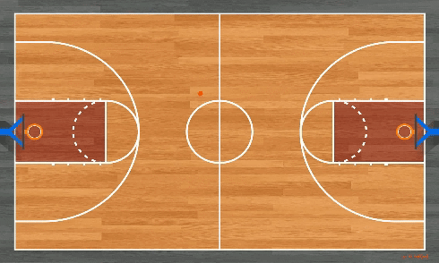

# Jing-En Huang
 📱 (+886) 927-619-756 | ✉️ (Academic) jingenhuang@citi.sinica.edu.tw | ✉️ (Personal) jing0en0huang@gmail.com

## Objective
As a mathematics student passionate about artificial intelligence, I leverage my mathematical expertise to solve real-world computer vision challenges through AI integration. Recently, I developed a real-time automated system for tracking and analyzing basketball matches using computer vision, deep learning models, and advanced mathematical techniques. Additionally, I led teams in three AI Cup competitions, achieving commendable results in each.

## Experience
#### Research Assistant - Research Center for Information Technology Innovation, Academia Sinica (Jan. 2024 - present)
- Developing a synthetic dataset generation framework, rectify faults in real-world datasets.
- Implementing the framework, reducing manpower and time costs for collecting image datum.
- Utilizing this method, enhancing performance of models trained on real-world datasets.

#### Undergraduate Researcher - Undergraduate Research Program, National Center for Theoretical Sciences Mathematics Division (Jun. 2022 - Jun. 2023)
- Proposed a Total Variation model, improving denoising performance by **60%**.
- Conducted theoretical proof for convergence of the model.
- Extended the method to surface denoising through surface parametrization.

#### Research Assistant - Research Combining Mixed Reality Display and the Field of Artificial Intelligence, National Taiwan Normal University ( Jul. 2022 - Jun. 2024)
- Engineered a real-time system of tracking and analyzing basketball matches via computer vision.
- Developed the end-to-end system, reducing positioning error by **35%** compared to infrared devices.
- Implemented the system in the NTNU gymnasium for coaches to analyze basketball matches.

#### Research Assistant - Practical Applications of Computational Geometry in Three‐Dimensional Imaging, National Taiwan Normal University (Jul. 2021 - Jun. 2023)
- Implemented an image stitching framework, achieving **23%** times faster than Photoshop.
- Proposed a mismatch detecting algorithm, enhancing the stitching accuracy of the SIFT algorithm.
- Proposed a Poisson‐based smoothing method, integrating images with severe chromatic aberration.
- Proposed a conformal reshaping method, refining results and ensuring image data integrity.

## Education
#### National Taiwan Normal University - Bachelor of Mathematics
- TA Course: Computer Programming
- A+ Related Courses:
  - Mathematics: Numerical Analysis, Linear Programming, Statistics, Probability
  - Computer Science: Data Science and Computer Programming, Computer Programming and Data Analysis in Sports, Computational Thinking and Programming

#### Taipei Municipal Chenggong High School - Math and Science Talented Class
- Computer Science and Information Engineering Division

## Publications
- Jing-En Huang, Jia-Wei Liao, Ku-Te Lin, et al. An Improved Variational Method for Image Denoising (2024). [[Paper]](https://arxiv.org/abs/2410.02587 "Paper")

## Projects
### A Real‑Time Automatic System of Tracking and Analyzing Basketball Matches based on Computer Vision and Deep Learning Model
- Developed a pipeline to locate players and ball on a 3D virtual tactical board in real‑time.
- Eliminated the need for players to wear extra infrared equipment that could obstruct their movements.
- Ensured the system operates as stable and fast as traditional infrared equipment.
- Installed the system in the NTNU gymnasium for coaches to use and test.

### An Improved Variational Method for Image Denoising [[Demo]](https://github.com/AngusBB/An-Improved-Variational-Method-for-Image-Denoising/tree/main "DEMO")
- Proposed a model that exhibits superior denoising performance compared to classic Total Variation methods.
- Designed an algorithm with a higher convergence rate than other classic Total Variation methods.
- Proved the convergence of the algorithm theoretically.
- Extended the method to surface denoising through surface parametrization.

### A Study on the Image Stitching Technology
- Achieved an image stitching process that is 0.23 times faster than Photoshop.
- Introduced a Poisson‑based smoothing method to seamlessly integrate images with severe chromatic aberration.
- Applied conformal reshaping to the stitching process to refine results and ensure image data integrity.
- Enhanced the stitching accuracy of the SIFT algorithm with mismatch detection.

### A Small Object Detection Framework for Unmanned Aerial Vehicles Images [[Report]](assets/2022_AICUP_UAV.pdf "Report")
- Proposed a Small Object Augmentation (SOA) algorithm to improve the detection model’s ability to recognize small objects.
- Achieved a 30% improvement in small object recognition compared to models without the SOA algorithm.

### An AI Referee of Badminton Matches
- Developed a pipeline for analyzing single‑camera perspective broadcasts of badminton matches.

## Honors & Awards
**Excellent Poster Paper Award**,&nbsp;&nbsp;2024 Taiwan Society for Industrial and Applied Mathematics \
**Most Popular Award**,&nbsp;&nbsp;&nbsp;&nbsp;&nbsp;&nbsp;&nbsp;&nbsp;&nbsp;&nbsp;&nbsp;&nbsp;&nbsp;&nbsp;&nbsp;&nbsp;&nbsp;&nbsp;2024 Taiwan Society for Industrial and Applied Mathematics \
**Excellent Presentation Award**,&nbsp;&nbsp;The 14th Japan‑Taiwan Joint Workshop in Applied Mathematics \
**Honorable Mention Award**,&nbsp;&nbsp;&nbsp;&nbsp;&nbsp;&nbsp;&nbsp;&nbsp;AI CUP 2022 Fall UAV Object Detection Competition \
**Honorable Mention Award**,&nbsp;&nbsp;&nbsp;&nbsp;&nbsp;&nbsp;&nbsp;&nbsp;AI CUP 2022 Fall Crop Image Recognition Competition \
**Most Popular Award**,&nbsp;&nbsp;&nbsp;&nbsp;&nbsp;&nbsp;&nbsp;&nbsp;&nbsp;&nbsp;&nbsp;&nbsp;&nbsp;&nbsp;&nbsp;&nbsp;&nbsp;&nbsp;2023 Taiwan Society for Industrial and Applied Mathematics \
**Excellent Presentation Award**,&nbsp;&nbsp;The 13th Japan‑Taiwan Joint Workshop in Applied Mathematics \
**Excellent Poster Paper Award**,&nbsp;&nbsp;2022 Taiwan Society for Industrial and Applied Mathematics \
**Honorable Mention Award**,&nbsp;&nbsp;&nbsp;&nbsp;&nbsp;&nbsp;&nbsp;&nbsp;AI CUP 2022 Spring STAS Object Detection Competition \
**Excellent Presentation Award**,&nbsp;&nbsp;The 12th Japan‑Taiwan Joint Workshop in Applied Mathematics

## Presentation
**TWSIAM 2024 Poster Presentation** \
&nbsp;&nbsp;&nbsp;&nbsp;*Enhanced Real-World VQA: A Selective-Based Approach* \
**SITCON 2024** \
&nbsp;&nbsp;&nbsp;&nbsp;*Enhanced Real-World VQA: A Selective-Based Approach* \
**The 14th Japan-Taiwan Joint Workshop for Young Scholars in Applied Mathematics** \
&nbsp;&nbsp;&nbsp;&nbsp;*Multi-Camera Multi-People Tracking on Basketball Matches Based on Deep Learning Models* \
**2023 NCTS Undergraduate Research Program Presentation** \
&nbsp;&nbsp;&nbsp;&nbsp;*Mixed-Norm Total Variation Denoising Model with Application to Surface Imaging* \
**TWSIAM 2023 Poster Presentation** \
&nbsp;&nbsp;&nbsp;&nbsp;*An AI Referee of Badminton Matches* \
**2023 NCTS Student Workshop on Scientific Computing** \
&nbsp;&nbsp;&nbsp;&nbsp;*An Improved Variational Method for Image Denoising* \
**The 13th Japan-Taiwan Joint Workshop for Young Scholars in Applied Mathematics** \
&nbsp;&nbsp;&nbsp;&nbsp;*A Real-Time Automatic System of Tracking Basketball Matches based on Deep Learning Models* \
**2022 NCTS-USRP Final Presentation** \
&nbsp;&nbsp;&nbsp;&nbsp;*Numerical Methods for Image and Geometry Processing* \
**TWSIAM 2022 Poster Presentation** \
&nbsp;&nbsp;&nbsp;&nbsp;*Real-Time Automatic Tracking of Basketball and Players by Computer Vision based on Deep Learning Models* \
**The 12th Japan-Taiwan Joint Workshop for Young Scholars in Applied Mathematics** \
&nbsp;&nbsp;&nbsp;&nbsp;*A Study on the Image Stitching Technology* \
**2022 NCTS Student Mini-Symposium in Applied Mathematics** \
&nbsp;&nbsp;&nbsp;&nbsp;*A Study on the Image Stitching Technology*

## Certifications
- Programming Teaching Assistant of Department of Mathematics
- National Center for Theoretical Sciences Mathematics Division Undergraduate Research Program
- National Center for Theoretical Sciences Mathematics Division Undergraduate Summer Research Program
- Taipei Municipal Cheng-Gong High School Science and Math Talented Class
- Go Professional Dan Certificate

## Programming skills
Language
- C, C++, MATLAB, Python, C#, LaTeX, PHP, Java(Android)

Developer Tool
- VSCode, Xcode, MATLAB, PyCharm, Visual Studio, Unity, Android Studio
